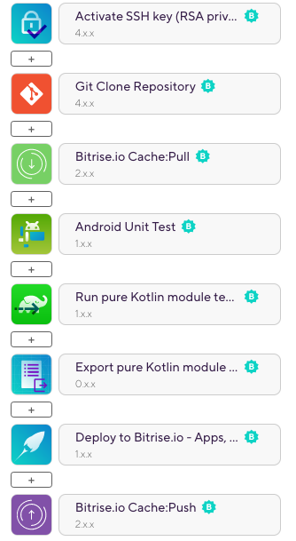

# Bitrise Android Sample

This is a sample Android project that demonstrates a multi-module project CI/CD setup on [Bitrise](https://bitrise.io). Build history is publicly available [here](https://app.bitrise.io/app/d60012f2d2688746#/builds).

## Project setup and config

The project consists of the following modules:

- `:feature:example1`: An Android library module
- `:feature:example2`: Another Android library module
- `:lib-example`: A pure Java/Kotlin module without any Android dependency
- `:app`: The main app module, having explicit dependencies on the above modules

### Bitrise Workflow

#### `primary` Workflow

Workflow steps

This workflow runs unit tests in every module. The [Android Unit Test](https://www.bitrise.io/integrations/steps/android-unit-test) discovers tests in every _Android module_, and exports test results both as build artifacts and for the [Test Reports add-on](https://www.bitrise.io/add-ons/mobile-test-reporting).

For pure Java/Kotlin modules, a [Gradle Runner](https://www.bitrise.io/integrations/steps/gradle-runner) step is used to run the `:lib-example:test` Gradle task. Test results are exported via the [Custom test results](https://www.bitrise.io/integrations/steps/custom-test-results-export) step. This step collects the JUnit test result XML from the module's build folder, and makes the report available via the Test Reports add-on.

__Note:__ if your project doesn't have any pure Java/Kotlin modules, you can remove the _Gradle Runner_ and _Custom test results_ steps from your workflow.
